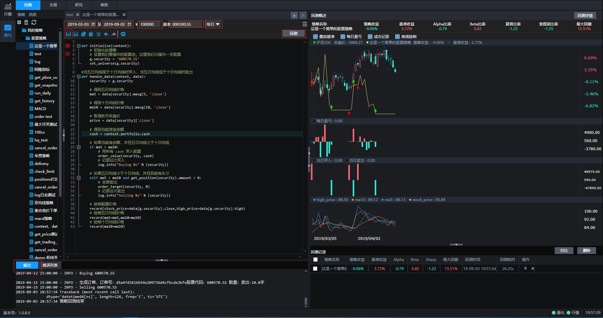
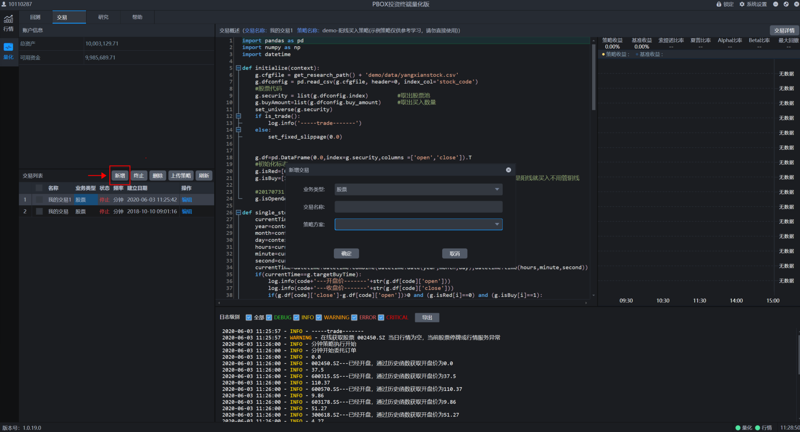
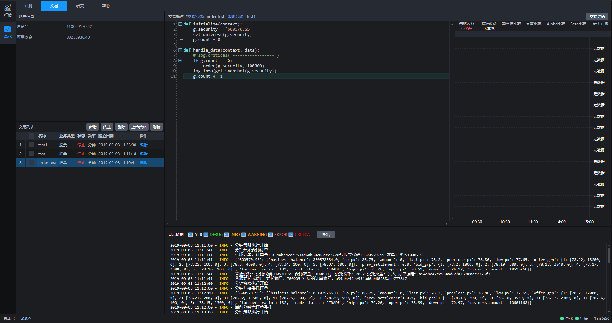
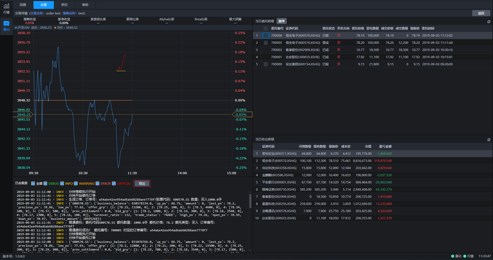

# 新建策略

开始回测和交易前需要先新建策略，点击下图中左上角标识进行策略添加。可以选择不同的业务类型（比如股票），然后给策略设定一个名称，添加成功后可以在默认策略模板基础上进行策略编写。

---

# 新建回测

策略添加完成后就可以开始进行回测操作了。回测之前需要对开始时间、结束时间、回测资金、回测基准、回测频率几个要素进行设定，设定完毕后点击保存。然后再点击回测按键，系统就会开始运行回测，回测的评价指标、收益曲线、日志都会在界面中展现。

---

# 新建交易

交易界面点击新增按键进行新增交易操作，策略方案中的对象为所有策略列表中的策略，给本次交易设定名称并点击确定后系统就开始运行交易了。

交易开始运行后，可以实时看到总资产和可用资金情况，同时可以在交易列表查询交易状态。

交易开始运行后，可以点击交易详情，查看策略评价指标、交易明细、持仓明细、交易日志。

