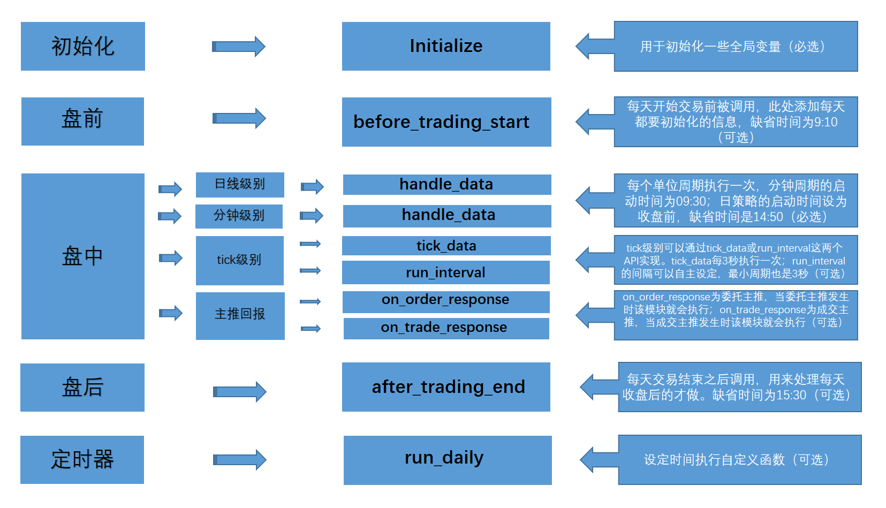

# 业务流程框架

ptrade量化引擎以事件触发为基础，通过初始化事件（initialize）、盘前事件（before_trading_start）、盘中事件（handle_data）、盘后事件（after_trading_end）来完成每个交易日的策略任务。

initialize和handle_data是一个允许运行策略的最基础结构，也就是必选项，before_trading_start和after_trading_end是可以按需运行的。

handle_data仅满足日线和分钟级别的盘中处理，tick级别的盘中处理则需要通过tick_data或者run_interval来实现。

ptrade还支持委托主推事件（on_order_respense）、交易主推事件（on_trade_response），可以通过委托和成交的信息来处理策略逻辑，是tick级的一个补充。

除了以上的一些事件以外，ptrade也支持通过定时任务来运行策略逻辑，可以通过run_daily接口实现。



### initialize（必选）

```python
initialize(context)
```

#### 使用场景

该函数仅在回测、交易模块可用

#### 接口说明

该函数用于初始化一些全局变量，是策略运行的唯二必须定义函数之一。

注意事项：

该函数只会在回测和交易启动的时候运行一次

#### 可调用接口

| [set_universe(回测/交易)](#set_universe) | [set_benchmark(回测/交易)](#set_benchmark) | [set_commission(回测)](#set_commission) |  |
| --- | --- | --- | --- |
| [set_fixed_slippage(回测)](#set_fixed_slippage) | [set_slippage(回测)](#set_slippage) | [set_volume_ratio(回测)](#set_volume_ratio) |  |
| [set_limit_mode(回测)](#set_limit_mode) | [set_yesterday_position(回测)](#set_yesterday_position) | [set_parameters(回测/交易)](#set_parameters) | [run_daily(回测/交易)](#run_daily) |
| [run_interval(交易)](#run_interval) | [get_trading_day(研究/回测/交易)](#get_trading_day) | [get_all_trades_days(研究/回测/交易)](#get_all_trades_days) |  |
| [get_trade_days(交易)](#get_trade_days) | [convert_position_from_csv(回测)](#convert_position_from_csv) | [get_user_name(回测/交易)](#get_user_name) |  |
| [is_trade(回测/交易)](#is_trade) | [get_research_path(回测/交易)](#get_research_path) | [permission_test(交易)](#permission_test) |  |
| [set_future_commission(回测(期货))](#set_future_commission) | [set_margin_rate(回测(期货))](#set_margin_rate) | [get_margin_rate(回测(期货))](#get_margin_rate) |  |
| [create_dir(回测/交易)](#create_dir) |  |  |  |

#### 参数

context: [Context对象](#Context)，存放有当前的账户及持仓信息；

#### 返回

None

#### 示例

```python
def initialize(context):
    #g为全局对象
    g.security = '600570.SS'
    set_universe(g.security)

def handle_data(context, data):
    order('600570.SS',100)
```

### before_trading_start（可选）

```python
before_trading_start(context, data)
```

#### 使用场景

该函数仅在回测、交易模块可用

#### 接口说明

该函数在每天开始交易前被调用一次，用于添加每天都要初始化的信息，如无盘前初始化需求，该函数可以在策略中不做定义。

注意事项：

1. 在回测中，该函数在每个回测交易日8:30分执行。
2. 在交易中，该函数在开启交易时立即执行，从隔日开始每天9:10分(默认)执行。
3. 当在9:10前开启交易时，受行情未更新原因在该函数内调用实时行情接口会导致数据有误。可通过在该函数内sleep至9:10分或调用实时行情接口改为run_daily执行等方式进行避免。

#### 可调用接口

| [set_universe(回测/交易)](#set_universe) | [get_Ashares(研究/回测/交易)](#get_Ashares) | [set_yesterday_position(回测)](#set_yesterday_position) |
| --- | --- | --- |
| [get_stock_info(研究/回测/交易)](#get_stock_info) | [get_index_stocks(研究/回测/交易)](#get_index_stocks) | [get_fundamentals(研究/回测/交易)](#get_fundamentals) |
| [get_trading_day(回测/交易)](#get_trading_day) | [get_all_trades_days(研究/回测/交易)](#get_all_trades_days) | [get_trade_days(研究/回测/交易)](#get_trade_days) |
| [get_history(回测/交易)](#get_history) | [get_price(研究/回测/交易)](#get_price) | [get_individual_entrust(交易)](#get_individual_entrust) |
| [get_individual_transcation(交易)](#get_individual_transcation) | [convert_position_from_csv(回测)](#convert_position_from_csv) | [get_stock_name(研究/回测/交易)](#get_stock_name) |
| [get_stock_status(研究/回测/交易)](#get_stock_status) | [get_stock_exrights(研究/回测/交易)](#get_stock_exrights) | [get_stock_blocks(研究/回测/交易)](#get_stock_blocks) |
| [get_etf_list(交易)](#get_etf_list) | [get_industry_stocks(研究/回测/交易)](#get_industry_stocks) | [get_user_name(回测/交易)](#get_user_name) |
| [get_cb_list(交易)](#get_cb_list) | [get_deliver(交易)](#get_deliver) | [get_fundjour(交易)](#get_fundjour) |
| [get_research_path(回测/交易)](#get_research_path) | [get_market_list(研究/回测/交易)](#get_market_list) | [get_market_detail(研究/回测/交易)](#get_market_detail) |
| [permission_test(交易)](#permission_test) | [get_trade_name(交易)](#get_trade_name) | [set_future_commission(回测(期货))](#set_future_commission) |
| [set_margin_rate(回测(期货))](#set_margin_rate) | [get_margin_rate(回测(期货))](#get_margin_rate) | [get_instruments(回测/交易(期货))](#get_instruments) |
| [get_MACD(回测/交易)](#get_MACD) | [get_KDJ(回测/交易)](#get_KDJ) | [get_RSI(回测/交易)](#get_RSI) |
| [get_CCI(回测/交易)](#get_CCI) | [create_dir(回测/交易)](#create_dir) |  |

#### 参数

context: [Context对象](#Context)，存放有当前的账户及持仓信息；

data：保留字段暂无数据；

#### 返回

None

#### 示例

```python
def initialize(context):
    #g为全局变量
    g.security = '600570.SS'
    set_universe(g.security)

def before_trading_start(context, data):
    log.info(g.security)

def handle_data(context, data):
    order('600570.SS',100)
```

### handle_data（必选）

```python
handle_data(context, data)
```

#### 使用场景

该函数仅在回测、交易模块可用

#### 接口说明

该函数在交易时间内按指定的周期频率运行，是用于处理策略交易的主要模块，根据策略保存时的周期参数分为每分钟运行和每天运行，是策略运行的唯二必须定义函数之一。

注意事项：

1. 该函数每个单位周期执行一次
2. 如果是日线级别策略，每天执行一次。股票回测场景下，在15:00执行；股票交易场景下，执行时间为券商实际配置时间。
3. 如果是分钟级别策略，每分钟执行一次，股票回测场景下，执行时间为9:31 -- 15:00，股票交易场景下，执行时间为9:30 -- 14:59。
4. 回测与交易中，handle_data函数不会在非交易日触发（如回测或交易起始日期为2015年12月21日，则策略在2016年1月1日-3日时，handle_data不会运行，4日继续运行）。

#### 可调用接口

| [get_trading_day(回测/交易)](#get_trading_day) | [get_all_trades_days(研究/回测/交易)](#get_all_trades_days) | [get_trade_days(研究/回测/交易)](#get_trade_days) |  |  |
| --- | --- | --- | --- | --- |
| [get_history(回测/交易)](#get_history) | [get_price(研究/回测/交易)](#get_price) | [get_individual_entrust(交易)](#get_individual_entrust) |  |  |
| [get_individual_transcation(交易)](#get_individual_transcation) | [get_gear_price(交易)](#get_gear_price) | [get_stock_name(研究/回测/交易)](#get_stock_name) |  |  |
| [get_stock_status(研究/回测/交易)](#get_stock_status) | [get_stock_exrights(研究/回测/交易)](#get_stock_exrights) | [get_stock_blocks(研究/回测/交易)](#get_stock_blocks) |  |  |
| [get_index_stocks(研究/回测/交易)](#get_index_stocks) | [get_industry_stocks(研究/回测/交易)](#get_industry_stocks) | [get_fundamentals(研究/回测/交易)](#get_fundamentals) |  |  |
| [get_Ashares(研究/回测/交易)](#get_Ashares) | [get_snapshot(交易)](#get_snapshot) | [convert_position_from_csv(回测)](#convert_position_from_csv) | [get_cb_info(研究/交易)](#get_cb_info) | [get_trend_data(研究/回测/交易)](#get_trend_data) |
| [order(回测/交易)](#order) | [order_target(回测/交易)](#order_target) | [order_value(回测/交易)](#order_value) |  |  |
| [order_target_value(回测/交易)](#order_target_value) | [order_market(交易)](#order_market) | [ipo_stocks_order(交易)](#ipo_stocks_order) |  |  |
| [after_trading_order(交易)](#after_trading_order) | [after_trading_cancel_order(交易)](#after_trading_cancel_order) | [etf_basket_order(交易)](#etf_basket_order) |  |  |
| [etf_purchase_redemption(交易)](#etf_purchase_redemption) | [cancel_order(回测/交易)](#cancel_order) | [get_stock_info(研究/回测/交易)](#get_stock_info) |  |  |
| [get_order(回测/交易)](#get_order) | [get_orders(回测/交易)](#get_orders) | [get_open_orders(回测/交易)](#get_open_orders) |  |  |
| [get_trades(回测/交易)](#get_trades) | [get_position(回测/交易)](#get_position) | [get_positions(回测/交易)](#get_positions) |  |  |
| [get_etf_info(交易)](#get_etf_info) | [get_etf_stock_info(交易)](#get_etf_stock_info) | [get_etf_stock_list(交易)](#get_etf_stock_list) |  |  |
| [get_etf_list(交易)](#get_etf_list) | [get_all_orders(交易)](#get_all_orders) | [cancel_order_ex(交易)](#cancel_order_ex) |  |  |
| [debt_to_stock_order(交易)](#debt_to_stock_order) | [get_user_name(回测/交易)](#get_user_name) | [get_research_path(回测/交易)](#get_research_path) |  |  |
| [get_marginsec_stocks(交易)](#get_marginsec_stocks) | [get_margincash_stocks(交易)](#get_margincash_stocks) | [debt_to_stock_order(交易)](#debt_to_stock_order) |  |  |
| [get_margin_contractreal(交易)](#get_margin_contractreal) | [get_margin_contract(交易)](#get_margin_contract) | [marginsec_direct_refund(交易)](#marginsec_direct_refund) |  |  |
| [get_margin_entrans_amount(交易)](#get_margin_entrans_amount) | [get_margin_contract(交易)](#get_margin_contract) | [margincash_direct_refund(交易)](#margincash_direct_refund) |  |  |
| [marginsec_open(交易)](#marginsec_open) | [marginsec_close(交易)](#marginsec_close) | [margincash_open(交易)](#margincash_open) |  |  |
| [margincash_close(交易)](#margincash_close) | [margin_trade(交易)](#margin_trade) | [get_marginsec_close_amount(交易)](#get_marginsec_close_amount) |  |  |
| [get_marginsec_open_amount(交易)](#get_marginsec_open_amount) | [get_margincash_close_amount(交易)](#get_margincash_close_amount) | [get_margincash_open_amount(交易)](#get_margincash_open_amount) |  |  |
| [get_cb_list(交易)](#get_cb_list) | [get_tick_direction(交易)](#get_tick_direction) | [get_sort_msg(交易)](#get_sort_msg) |  |  |
| [get_trade_name(交易)](#get_trade_name) | [get_margin_rate(回测(期货))](#get_margin_rate) | [get_instruments(回测/交易(期货)](#get_instruments) |  |  |
| [buy_open(回测/交易(期货)](#buy_open) | [sell_close(回测/交易(期货)](#sell_close) | [sell_close(回测/交易(期货)](#sell_close) |  |  |
| [buy_close(回测/交易(期货)](#buy_close) | [get_MACD(回测/交易)](#get_MACD) | [get_KDJ(回测/交易)](#get_KDJ) |  |  |
| [get_RSI(回测/交易)](#get_RSI) | [get_CCI(回测/交易)](#get_CCI) | [create_dir(回测/交易)](#create_dir) |  |  |

#### 参数

context: [Context对象](#Context)，存放有当前的账户及持仓信息；

data：一个字典(dict)，key是标的代码，value是当时的[SecurityUnitData对象](#SecurityUnitData)，存放当前周期（日线策略，则是当天；分钟策略，则是这一分钟）的数据；

注意：为了加速，data中的数据只包含股票池中所订阅标的的信息，可使用data[security]的方式来获取当前周期对应的标的信息；

#### 返回

None

#### 示例

```python
def initialize(context):
    #g为全局变量
    g.security = '600570.SS'
    set_universe(g.security)

def handle_data(context, data):
    current_price = data[g.security].price # SecurityUnitData 是一个对象，访问对象值用 . 号加属性名称。属性值参照文末SecurityUnitData对象说明文档。
    order('600570.SS',100)
```

### after_trading_end（可选）

```python
after_trading_end(context, data)
```

#### 使用场景

该函数仅在回测、交易模块可用

#### 接口说明

该函数会在每天交易结束之后调用，用于处理每天收盘后的操作，如无盘后处理需求，该函数可以在策略中不做定义。

注意事项：

1. 该函数只会执行一次
2. 该函数执行时间为由券商配置决定，一般为15:30。

#### 可调用接口

| [get_trades_file(回测)](#get_trades_file) | [get_stock_info(研究/回测/交易)](#get_stock_info) | [get_open_orders(回测/交易)](#get_open_orders) |
| --- | --- | --- |
| [get_all_trades_days(研究/回测/交易)](#get_all_trades_days) | [get_trade_days(研究/回测/交易)](#get_trade_days) | [get_history(回测/交易)](#get_history) |
| [get_price(研究/回测/交易)](#get_price) | [get_individual_entrust(交易)](#get_individual_entrust) | [get_individual_transcation(交易)](#get_individual_transcation) |
| [get_Ashares(研究/回测/交易)](#get_Ashares) | [get_stock_name(研究/回测/交易)](#get_stock_name) | [get_stock_status(研究/回测/交易)](#get_stock_status) |
| [get_stock_exrights(研究/回测/交易)](#get_stock_exrights) | [get_stock_blocks(研究/回测/交易)](#get_stock_blocks) | [get_index_stocks(研究/回测/交易)](#get_index_stocks) |
| [get_industry_stocks(研究/回测/交易)](#get_industry_stocks) | [get_fundamentals(研究/回测/交易)](#get_fundamentals) | [get_user_name(回测/交易)](#get_user_name) |
| [get_cb_list(交易)](#get_cb_list) | [get_deliver(交易)](#get_deliver) | [get_fundjour(交易)](#get_fundjour) |
| [get_research_path(回测/交易)](#get_research_path) | [get_trade_name(交易)](#get_trade_name) | [get_market_list(研究/回测/交易)](#get_market_list) |
| [get_market_detail(研究/回测/交易)](#get_market_detail) | [permission_test(交易)](#permission_test) | [get_tick_direction(交易)](#get_tick_direction) |
| [get_sort_msg(交易)](#get_sort_msg) | [get_margin_rate(回测(期货))](#get_margin_rate) | [get_margin_rate(回测(期货))](#get_margin_rate) |
| [get_instruments(回测/交易(期货))](#get_instruments) | [get_MACD(回测/交易)](#get_MACD) | [get_KDJ(回测/交易)](#get_KDJ) |
| [get_RSI(回测/交易)](#get_RSI) | [get_CCI(回测/交易)](#get_CCI) | [create_dir(回测/交易)](#create_dir) |

#### 参数

context: [Context对象](#Context)，存放有当前的账户及持仓信息；

data：保留字段暂无数据；

#### 返回

None

#### 示例

```python
def initialize(context):
    #g为全局变量
    g.security = '600570.SS'
    set_universe(g.security)

def handle_data(context, data):
    order('600570.SS',100)

def after_trading_end(context, data):
    log.info(g.security)
```

### tick_data（可选）

```python
tick_data(context, data)
```

#### 使用场景

该函数仅交易模块可用

#### 接口说明

该函数可以用于处理tick级别策略的交易逻辑，每隔3秒执行一次，如无tick处理需求，该函数可以在策略中不做定义。

注意事项：

1. 该函数执行时间为9:30 -- 14:59。
2. 该函数中只能使用order_tick进行对应的下单操作。
3. 该函数中的data和[handle_data](#handle_data)函数中的data是不一样的，请勿混肴。
4. 参数data中包含的逐笔委托，逐笔成交数据需开通level2行情才有数据推送，否则对应数据返回None。

#### 可调用接口

| [get_trading_day(研究/回测/交易)](#get_trading_day) | [get_all_trades_days(研究/回测/交易)](#get_all_trades_days) | [get_trade_days(研究/回测/交易)](#get_trade_days) |
| --- | --- | --- |
| [get_cb_list(交易)](#get_cb_list) | [get_history(回测/交易)](#get_history) | [get_price(研究/回测/交易)](#get_price) |
| [get_individual_entrust(交易)](#get_individual_entrust) | [get_individual_transcation(交易)](#get_individual_transcation) | [get_tick_direction(交易)](#get_tick_direction) |
| [get_sort_msg(交易)](#get_sort_msg) | [get_etf_info(交易)](#get_etf_info) | [get_etf_stock_info(交易)](#get_etf_stock_info) |
| [get_gear_price(交易)](#get_gear_price) | [get_snapshot(交易)](#get_snapshot) | [get_stock_name(研究/回测/交易)](#get_stock_name) |
| [get_stock_info(研究/回测/交易)](#get_stock_info) | [get_stock_status(研究/回测/交易)](#get_stock_status) | [get_stock_exrights(研究/回测/交易)](#get_stock_exrights) |
| [get_stock_blocks(研究/回测/交易)](#get_stock_blocks) | [get_index_stocks(研究/回测/交易)](#get_index_stocks) | [get_etf_stock_list(交易)](#get_etf_stock_list) |
| [get_industry_stocks(研究/回测/交易)](#get_industry_stocks) | [get_fundamentals(研究/回测/交易)](#get_fundamentals) | [get_Ashares(研究/回测/交易)](#get_Ashares) |
| [get_etf_list(交易)](#get_etf_list) | [get_user_name(回测/交易)](#get_user_name) | [get_research_path(研究/回测/交易)](#get_research_path) |
| [get_trade_name(交易)](#get_trade_name) | [set_universe(回测/交易)](#set_universe) | [order(回测/交易)](#order) |
| [order_target(回测/交易)](#order_target) | [order_value(回测/交易)](#order_value) | [order_target_value(回测/交易)](#order_target_value) |
| [order_market(交易)](#order_market) | [ipo_stocks_order(交易)](#ipo_stocks_order) | [after_trading_order(交易)](#after_trading_order) |
| [after_trading_cancel_order(交易)](#after_trading_cancel_order) | [etf_basket_order(交易)](#etf_basket_order) | [etf_purchase_redemption(交易)](#etf_purchase_redemption) |
| [get_positions(回测/交易)](#get_positions) | [order_tick(交易)](#order_tick) | [cancel_order(回测/交易)](#cancel_order) |
| [cancel_order_ex(交易)](#cancel_order_ex) | [debt_to_stock_order(交易)](#debt_to_stock_order) | [get_open_orders(回测/交易)](#get_open_orders) |
| [get_order(回测/交易)](#get_order) | [get_orders(回测/交易)](#get_orders) | [get_all_orders(交易)](#get_all_orders) |
| [get_trades(回测/交易)](#get_trades) | [get_position(回测/交易)](#get_position) | [margin_trade(交易)](#margin_trade) |
| [margincash_open(交易)](#margincash_open) | [margincash_close(交易)](#margincash_close) | [margincash_direct_refund(交易)](#margincash_direct_refund) |
| [marginsec_open(交易)](#marginsec_open) | [marginsec_close(交易)](#marginsec_close) | [marginsec_direct_refund(交易)](#marginsec_direct_refund) |
| [get_margincash_stocks(交易)](#get_margincash_stocks) | [get_marginsec_stocks(交易)](#get_marginsec_stocks) | [get_margin_contract(交易)](#get_margin_contract) |
| [get_margin_contractreal(交易)](#get_margin_contractreal) | [get_margin_assert(交易)](#get_margin_assert) | [get_assure_security_list(交易)](#get_assure_security_list) |
| [get_margincash_open_amount(交易)](#get_margincash_open_amount) | [get_margincash_close_amount(交易)](#get_margincash_close_amount) | [get_marginsec_open_amount(交易)](#get_marginsec_open_amount) |
| [get_marginsec_close_amount(交易)](#get_marginsec_close_amount) | [get_margin_entrans_amount(交易)](#get_margin_entrans_amount) | [buy_open(回测/交易(期货))](#buy_open) |
| [sell_close(回测/交易(期货))](#sell_close) | [sell_open(回测/交易(期货))](#sell_open) | [buy_close(回测/交易(期货))](#buy_close) |
| [get_instruments(回测/交易(期货))](#get_instruments) | [log(回测/交易)](#log) | [is_trade(回测/交易)](#is_trade) |
| [check_limit(交易)](#check_limit) | [send_email(交易)](#send_email) | [send_qywx(交易)](#send_qywx) |
| [get_MACD(回测/交易)](#get_MACD) | [get_KDJ(回测/交易)](#get_KDJ) | [get_RSI(回测/交易)](#get_RSI) |
| [get_CCI(回测/交易)](#get_CCI) | [create_dir(回测/交易)](#create_dir) |  |

#### 参数

context: [Context对象](#Context)，存放有当前的账户及持仓信息；

data: 一个字典（dict），key为对应的标的代码（如：'600570.SS'），value为一个字典（dict），包含order（逐笔委托）、tick（当前tick数据）、transcation（逐笔成交）三项

结构如下：

```
{'股票代码':
    {
        'order(最近一条逐笔委托)':DataFrame/None,
        'tick(当前tick数据)':DataFrame,
        'transcation(最近一条逐笔成交)':DataFrame/None,
    }
}
```

每项具体介绍：

```
order - 逐笔委托对应DataFrame包含字段：
    business_time：时间戳毫秒级
    hq_px：价格
    business_amount：委托量(单位：股)
    order_no：委托编号
    business_direction：委托方向
        0 – 卖；
        1 – 买；
        2 – 借入；
        3 – 出借；
    trans_kind：委托类别
        1-- 市价委托；
        2 -- 限价委托；
        3 -- 本方最优；
tick - tick数据对应DataFrame包含字段：
    amount：持仓量
    avg_px：均价
    bid_grp：买档位，dict类型，内容如：{1:[42.71,200,0],2:[42.74,200,0],3:[42.75,700,...，以档位为Key，以list为Value，每个Value包含：委托价格、委托数量和委托笔数；
    business_amount：成交数量 -单位：股；
    business_amount_in：内盘成交量；
    business_amount_out：外盘成交量
    business_balance：成交金额；
    business_count：成交笔数；
    circulation_amount：流通股本；
    close_px：今日收盘
    current_amount：最近成交量(现手)；
    down_px：跌停价格；
    end_trade_date：最后交易日
    entrust_diff：委差；
    entrust_rate：委比；
    high_px：最高价；
    hsTimeStamp：时间戳，格式为YYYYMMDDHHMISS，如20170711141612，表示2017年7月11日14时16分12秒的tick数据信息；
    issue_date：上市日期
    last_px：最新成交价；
    low_px：最低价；
    offer_grp：卖档位，dict类型，内容如：{1:[42.71,200,0],2:[42.74,200,0],3:[42.75,700,...，以档位为Key，以list为Value，每个Value包含：委托价格、委托数量和委托笔数；
    open_px：今开盘价；
    pb_rate：市净率；
    pe_rate：动态市盈率；
    preclose_px：昨收价；
    prev_settlement：昨结算
    start_trade_date：首个交易日
    tick_size：最小报价单位
    trade_mins：交易时间，距离开盘已过交易时间，如100则表示每日240分钟交易时间中的第100分钟；
    trade_status：交易状态；
        START -- 市场启动(初始化之后，集合竞价前)
        PRETR -- 盘前
        OCALL -- 开始集合竞价
        TRADE -- 交易(连续撮合)
        HALT -- 暂停交易
        SUSP -- 停盘
        BREAK -- 休市
        POSTR -- 盘后
        ENDTR -- 交易结束
        STOPT -- 长期停盘，停盘n天，n>=1
        DELISTED -- 退市
        POSMT -- 盘后交易
        PCALL -- 盘后集合竞价
        INIT -- 盘后固定价格启动前
        ENDPT -- 盘后固定价格闭市阶段
        POSSP -- 盘后固定价格停牌
    turnover_ratio：换手率
    up_px：涨停价格；
    vol_ratio：量比；
    wavg_px：加权平均价；
transcation - 逐笔成交对应DataFrame包含字段：
    business_time：时间戳毫秒级；
    hq_px：价格；
    business_amount：成交量 - 单位：股；
    trade_index：成交编号；
    business_direction：成交方向；
        0 – 卖；
        1 – 买；
    buy_no: 叫买方编号；
    sell_no: 叫卖方编号；
    trans_flag: 成交标记；
        0 – 普通成交；
        1 – 撤单成交；
    trans_identify_am: 盘后逐笔成交序号标识；
        0 – 盘中；
        1 – 盘后；
    channel_num: 成交通道信息；
```

返回

None

#### 示例

```python
def initialize(context):
    g.security = '600570.SS'
    set_universe(g.security)

def tick_data(context,data):
    # 获取买一价
    security = g.security
    current_price = eval(data[security]['tick']['bid_grp'][0])[1][0]
    log.info(current_price)
    # 获取买二价
    # current_price = eval(data[security]['tick']['bid_grp'][0])[2][0]
    # 获取买三量
    # current_amount = eval(data[security]['tick']['bid_grp'][0])[3][1]
    # 获取tick最高价
    # current_high_price = data[security]['tick']['high_px'][0]
    # 最近一笔逐笔成交的成交量
    # transcation = data[security]["transcation"]
    # business_amount = list(transcation["business_amount"])
    # if len(business_amount) > 0:
    #     log.info("最近一笔逐笔成交的成交量：%s" % business_amount[0])
    # 最近一笔逐笔委托的委托类别
    # order = data[security]["order"]
    # trans_kind = list(order["trans_kind"])
    # if len(trans_kind) > 0:
    #     log.info("最近一笔逐笔委托的委托类别：%s" % trans_kind[0])
    if current_price > 38.19:
        # 按买一档价格下单
        order_tick(security, 100, 1)

def handle_data(context, data):
    pass
```

### on_order_response - 委托主推(可选)

```python
on_order_response(context, order_list)
```

#### 使用场景

该函数仅在交易模块可用

#### 接口说明

该函数会在委托主推回调时响应，比引擎、get_order()和get_orders()函数更新Order状态的速度更快，适合对速度要求比较高的策略。

注意事项：

1. 目前可接收股票、可转债、ETF、LOF、期货代码的主推数据。
2. 当接到策略外交易产生的主推时(需券商配置默认不推送)，由于没有对应的Order对象，主推信息中order_id字段赋值为""。
3. 当在主推里调用委托接口时，需要进行判断处理避免无限迭代循环问题。

#### 可调用委托接口

| [order(回测/交易)](#order) | [order_target(回测/交易)](#order_target) | [order_value(回测/交易)](#order_value) |
| --- | --- | --- |
| [order_target_value(回测/交易)](#order_target_value) | [order_market(交易)](#order_market) | [ipo_stocks_order(交易)](#ipo_stocks_order) |
| [after_trading_order(交易)](#after_trading_order) | [after_trading_cancel_order(交易)](#after_trading_cancel_order) | [etf_basket_order(交易)](#etf_basket_order) |
| [etf_purchase_redemption(交易)](#etf_purchase_redemption) | [cancel_order(回测/交易)](#cancel_order) | [margin_trade(交易)](#margin_trade) |
| [margincash_open(交易)](#margincash_open) | [margincash_close(交易)](#margincash_close) | [margincash_direct_refund(交易)](#margincash_direct_refund) |
| [margincash_open(交易)](#marginsec_open) | [marginsec_close(交易)](#marginsec_close) | [marginsec_direct_refund(交易)](#marginsec_direct_refund) |
| [get_user_name(回测/交易)](#get_user_name) | [get_cb_list(交易)](#get_cb_list) | [get_instruments(回测/交易(期货))](#get_instruments) |

#### 参数

context: [Context对象](#Context)，存放有当前的账户及持仓信息；

order_list：一个列表，当前委托单发生变化时，发生变化的委托单列表。委托单以字典形式展现，内容包括：'entrust_no'(委托编号), 'error_info'(错误信息), 'order_time'(委托时间), 'stock_code'(股票代码), 'amount'(委托数量), 'price'(委托价格), 'business_amount'(成交数量), 'status'(委托状态), 'order_id'(委托订单号), 'entrust_type'(委托类别), 'entrust_prop'(委托属性), 'order_id'(Order订单编号)；

字段备注:

- 0 -- 委托
- 2 -- 撤单
- 4 -- 确认
- 6 -- 信用融资
- 7 -- 信用融券
- 9 -- 信用交易

- 0 -- 买卖
- 1 -- 配股
- 3 -- 申购
- 7 -- 转股
- 9 -- 股息
- N -- ETF申赎
- Q -- 对手方最优价格
- R -- 最优五档即时成交剩余转限价
- S -- 本方最优价格
- T -- 即时成交剩余撤销
- U -- 最优五档即时成交剩余撤销
- b -- 定价委托
- c -- 确认委托
- d -- 限价委托

- status -- 委托状态，详见[Order对象](#Order)；
- entrust_type -- 委托类别(str)
- entrust_prop -- 委托属性(str)

#### 返回

None

#### 接收到的主推格式如下:

```python
本交易产生的主推：[{'business_amount': 0.0, 'order_id': 'e71d1684c8a74b4ca00b3326c9eb8614', 'order_time': '2022-05-10 15:52:10.780', 'entrust_prop': '0', 'status': '2', 'price': 36.95, 'entrust_no': 700006, 'error_info': '', 'amount': 200, 'stock_code': '600570.SS', 'entrust_type': '0'}]
非本交易产生的主推：[{'business_amount': 0.0, 'order_id': '', 'order_time': '2022-05-10 15:54:30.204', 'entrust_prop': '0', 'status': '2', 'price': 36.95, 'entrust_no': 700008, 'error_info': '', 'amount': 200, 'stock_code': '600570.SS', 'entrust_type': '0'}]
```

#### 示例

```python
def initialize(context):
    g.security = ['600570.SS','002416.SZ']
    set_universe(g.security)
    g.flag = 0

def on_order_response(context, order_list):
    log.info(order_list)
    if(g.flag==0):
        order('600570.SS', 100)
        g.flag = 1
    else:
        log.info("end")

def handle_data(context, data):
    order('600570.SS', 100)
```

### on_trade_response - 交易主推(可选)

```python
on_trade_response (context, trade_list)
```

#### 使用场景

该函数仅在交易模块可用

#### 接口说明

该函数会在成交主推回调时响应，比引擎和get_trades()函数更新Order状态的速度更快，适合对速度要求比较高的策略。

注意事项：

1. 目前可接收股票、可转债、ETF、LOF、期货代码的主推数据。
2. 当接到策略外交易产生的主推时(需券商配置默认不推送)，由于没有对应的Order对象，主推信息中order_id字段赋值为""。
3. 当在主推里调用委托接口时，需要进行判断处理避免无限迭代循环问题。
4. 每个策略的回调事件是独立的，不会相互影响。2个策略A和B同时运行，A策略成交时触发的回调事件不会被B策略的on_trade_response捕获

#### 可调用委托接口

| [order(回测/交易)](#order) | [order_target(回测/交易)](#order_target) | [order_value(回测/交易)](#order_value) |
| --- | --- | --- |
| [order_target_value(回测/交易)](#order_target_value) | [order_market(交易)](#order_market) | [ipo_stocks_order(交易)](#ipo_stocks_order) |
| [after_trading_order(交易)](#after_trading_order) | [after_trading_cancel_order(交易)](#after_trading_cancel_order) | [etf_basket_order(交易)](#etf_basket_order) |
| [etf_purchase_redemption(交易)](#etf_purchase_redemption) | [cancel_order(回测/交易)](#cancel_order) | [margin_trade(交易)](#margin_trade) |
| [margincash_open(交易)](#margincash_open) | [margincash_close(交易)](#margincash_close) | [margincash_direct_refund(交易)](#margincash_direct_refund) |
| [margincash_open(交易)](#marginsec_open) | [marginsec_close(交易)](#marginsec_close) | [marginsec_direct_refund(交易)](#marginsec_direct_refund) |
| [get_user_name(回测/交易)](#get_user_name) | [get_cb_list(交易)](#get_cb_list) | [get_instruments(回测/交易(期货))](#get_instruments) |

#### 参数

context: [Context对象](#Context)，存放有当前的账户及持仓信息；

trade_list：一个列表，当前成交单发生变化时，发生变化的成交单列表。成交单以字典形式展现，内容包括：'entrust_no'(委托编号), 'business_time'(成交时间), 'stock_code'(股票代码), 'entrust_bs'(成交方向), 'business_amount'(成交数量), 'business_price'(成交价格), 'business_balance'(成交额), 'business_id'(成交编号), 'status'(委托状态), 'order_id'(Order订单编号)；

字段备注:

- entrust_bs -- 成交方向(str)，1-买，2-卖；
- status -- 委托状态，详见[Order对象](#Order)；

#### 返回

None

#### 接收到的主推格式如下:

```python
本交易产生的主推：[{'status': '8', 'business_id': '76', 'business_amount': 200, 'order_id': 'e71d1684c8a74b4ca00b3326c9eb8614', 'entrust_no': 700006, 'business_balance': 7390.000000000001, 'business_price': 36.95, 'stock_code': '600570.SS', 'entrust_bs': '1', 'business_time': '2022-05-10 15:51:47'}]
非本交易产生的主推：[{'status': '8', 'business_id': 'b155235000000003', 'business_amount': 200, 'order_id': '', 'entrust_no': 700007, 'business_balance': 3000.0, 'business_price': 15.0, 'stock_code': '000001.SZ', 'entrust_bs': '1', 'business_time': '2022-05-10 15:52:35'}]
```

#### 示例

```python
def initialize(context):
    g.security = ['600570.SS','002416.SZ']
    set_universe(g.security)
    g.flag = 0

def on_trade_response(context, trade_list):
    log.info(trade_list)
    if(g.flag==0):
        order('600570.SS', 100)
        g.flag = 1
    else:
        log.info("end")

def handle_data(context, data):
    order('600570.SS', 100)
```

##### 注意：

如果是废单，如下单价格超过价格笼子，order函数依然会返回order_id，而不是None，并且在委托回调函数里面的状态status是2（已报），但在成交回调里面的status是9（废单）
