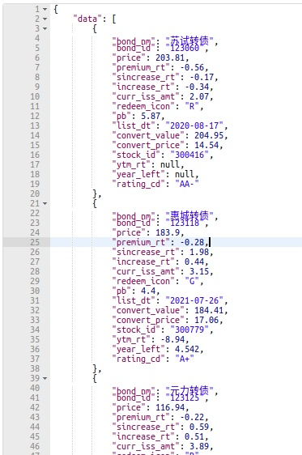
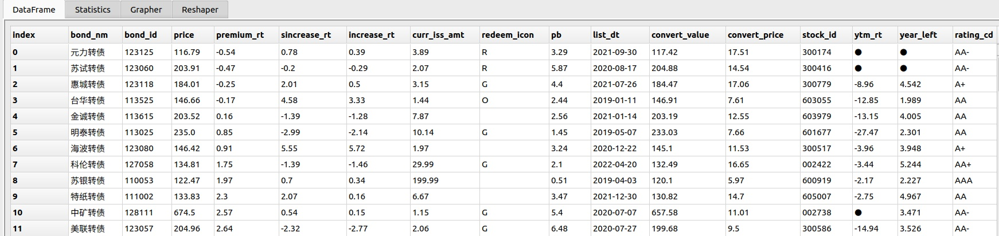
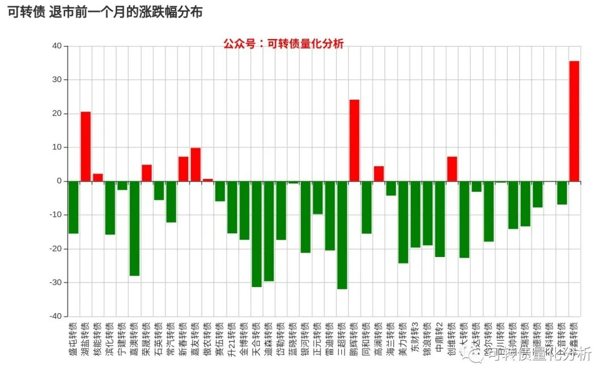
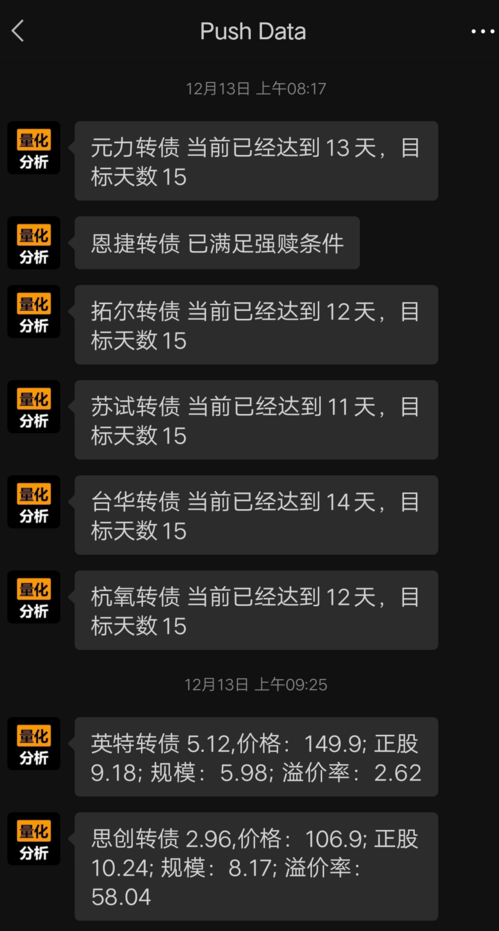
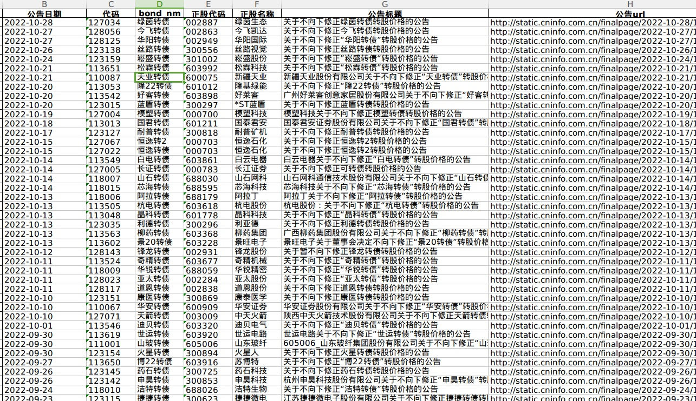

# 集合竞价追涨停策略

```python
def initialize(context):
    # 初始化此策略
    # 设置我们要操作的股票池, 这里我们只操作一支股票
    g.security = '600570.SS'
    set_universe(g.security)
    #每天9:23分运行集合竞价处理函数
    run_daily(context, aggregate_auction_func, time='9:23')  

def aggregate_auction_func(context):
    stock = g.security
    #最新价
    snapshot = get_snapshot(stock)
    price = snapshot[stock]['last_px']
    #涨停价
    up_limit = snapshot[stock]['up_px']
    #如果最新价不小于涨停价，买入
    if float(price) >= float(up_limit):
        order(g.security, 100, limit_price=up_limit)
    
def handle_data(context, data):
    pass

```


---

# tick级别均线策略

```python
def initialize(context):
    # 初始化此策略
    # 设置我们要操作的股票池, 这里我们只操作一支股票
    g.security = '600570.SS'
    set_universe(g.security)
    #每3秒运行一次主函数
    run_interval(context, func, seconds=3)
      
#盘前准备历史数据
def before_trading_start(context, data):
    history = get_history(10, '1d', 'close', g.security, fq='pre', include=False)
    g.close_array = history['close'].values
    
#当五日均线高于十日均线时买入，当五日均线低于十日均线时卖出
def func(context):
    
    stock = g.security
    
    #获取最新价
    snapshot = get_snapshot(stock)
    price = snapshot[stock]['last_px']
    
    # 得到五日均线价格
    days = 5
    ma5 = get_MA_day(stock, days, g.close_array[-4:], price)   
    # 得到十日均线价格
    days = 10
    ma10 = get_MA_day(stock, days, g.close_array[-9:], price)

    # 得到当前资金余额
    cash = context.portfolio.cash
    
    # 如果当前有余额，并且五日均线大于十日均线
    if ma5 > ma10:
        # 用所有 cash 买入股票
        order_value(stock, cash)
        # 记录这次买入
        log.info("Buying %s" % (stock))
        
    # 如果五日均线小于十日均线，并且目前有头寸
    elif ma5 < ma10 and get_position(stock).amount > 0:
        # 全部卖出
        order_target(stock, 0)
        # 记录这次卖出
        log.info("Selling %s" % (stock))    

#计算实时均线函数
def get_MA_day(stock,days,close_array,current_price):
    close_sum = close_array[-(days-1):].sum()
    MA = (current_price + close_sum)/days
    return MA

def handle_data(context, data):
    pass

```


---

# 双均线策略

```python
def initialize(context):
    # 初始化此策略
    # 设置我们要操作的股票池, 这里我们只操作一支股票
    g.security = '600570.SS'
    set_universe(g.security)
    
#当五日均线高于十日均线时买入，当五日均线低于十日均线时卖出
def handle_data(context, data):
    security = g.security

    #得到十日历史价格
    df = get_history(10, '1d', 'close', security, fq=None, include=False)
    
    # 得到五日均线价格
    ma5 = round(df['close'][-5:].mean(), 3)
    
    # 得到十日均线价格
    ma10 = round(df['close'][-10:].mean(), 3)

    # 取得昨天收盘价
    price = data[security]['close']

    # 得到当前资金余额
    cash = context.portfolio.cash
    
    # 如果当前有余额，并且五日均线大于十日均线
    if ma5 > ma10:
        # 用所有 cash 买入股票
        order_value(security, cash)
        # 记录这次买入
        log.info("Buying %s" % (security))
        
    # 如果五日均线小于十日均线，并且目前有头寸
    elif ma5 < ma10 and get_position(security).amount > 0:
        # 全部卖出
        order_target(security, 0)
        # 记录这次卖出
        log.info("Selling %s" % (security))

```


---

# 融资融券双均线策略

```python
def initialize(context):
    # 初始化策略
    # 设置我们要操作的股票池, 这里我们只操作一支股票
    g.security = "600570.SS"
    set_universe(g.security)

def before_trading_start(context, data):
    # 买入标识
    g.order_buy_flag = False
    # 卖出标识
    g.order_sell_flag = False

#当五日均线高于十日均线时买入，当五日均线低于十日均线时卖出
def handle_data(context, data):
    # 得到十日历史价格
    df = get_history(10, "1d", "close", g.security, fq=None, include=False)
    # 得到五日均线价格
    ma5 = round(df["close"][-5:].mean(), 3)
    # 得到十日均线价格
    ma10 = round(df["close"][-10:].mean(), 3)
    # 取得昨天收盘价
    price = data[g.security]["close"]
    # 如果五日均线大于十日均线
    if ma5 > ma10:
        if not g.order_buy_flag:
            # 获取最大可融资数量
            amount = get_margincash_open_amount(g.security).get(g.security)
            # 进行融资买入操作
            margincash_open(g.security, amount)
            # 记录这次操作
            log.info("Buying %s Amount %s" % (g.security, amount))
            # 当日已融资买入
            g.order_buy_flag = True

    # 如果五日均线小于十日均线，并且目前有头寸
    elif ma5 < ma10 and get_position(g.security).amount > 0:
        if not g.order_sell_flag:
            # 获取标的卖券还款最大可卖数量
            amount = get_margincash_close_amount(g.security).get(g.security)
            # 进行卖券还款操作
            margincash_close(g.security, -amount)
            # 记录这次操作
            log.info("Selling %s Amount %s" % (g.security, amount))
            # 当日已卖券还款
            g.order_sell_flag = True

```


---

# macd策略

指数平滑均线函数，以price计算，可以选择收盘、开盘价等价格，N为时间周期，m用于计算平滑系数a=m/(N+1)，EXPMA1为前一日值

```python
def f_expma(N,m,EXPMA1,price):
    a = m/(N+1)
    EXPMA2 = a * price + (1 - a)*EXPMA1
    return EXPMA2 #2为后一天值

#定义macd函数，输入平滑系数参数、前一日值，输出当日值
def macd(N1,N2,N3,m,EXPMA12_1,EXPMA26_1,DEA1,price):
    EXPMA12_2 = f_expma(N1,m,EXPMA12_1,price)
    EXPMA26_2 = f_expma(N2,m,EXPMA26_1,price)
    DIF2 = EXPMA12_2 - EXPMA26_2
    a = m/(N3+1)
    DEA2 = a * DIF2 + (1 - a)*DEA1
    BAR2=2*(DIF2-DEA2)
    return EXPMA12_2,EXPMA26_2,DIF2,DEA2,BAR2

def initialize(context):
    global init_price
    init_price = None
    # 获取沪深300股票
    g.security = get_index_stocks('000300.SS')
    #g.security = ['600570.SS']
    # 设置我们要操作的股票池, 这里我们只操作一支股票
    set_universe(g.security)

def handle_data(context, data):
    # 获取历史数据，这里只获取了2天的数据，如果希望最终MACD指标结果更准确最好是获取
    # 从股票上市至今的所有历史数据，即增加获取的天数
    close_price = get_history(2, '1d', field='close', security_list=g.security)
    #如果是停牌不进行计算
    for security in g.security:
        if data[security].is_open >0:
            global init_price,EXPMA12_1,EXPMA26_1,EXPMA12_2,EXPMA26_2,DIF1,DIF2,DEA1,DEA2
            if init_price is None:
                init_price = close_price[security].mean()#nan和N-1个数，mean为N-1个数的均值
                EXPMA12_1 = init_price
                EXPMA26_1 = init_price
                DIF1 = init_price
                DEA1 = init_price
            # m用于计算平滑系数a=m/(N+1)
            m = 2.0
            #设定指数平滑基期数
            N1 = 12
            N2 = 26
            N3 = 9
            EXPMA12_2,EXPMA26_2,DIF2,DEA2,BAR2 = macd(N1,N2,N3,m,EXPMA12_1,EXPMA26_1,DEA1,close_price[security][-1])
            # 取得当前价格
            current_price = data[security].price
            # 取得当前的现金
            cash = context.portfolio.cash
            # DIF、DEA均为正，DIF向上突破DEA，买入信号参考
            if DIF2 > 0 and DEA2 > 0 and DIF1 < DEA1 and DIF2 > DEA2:
                # 计算可以买多少只股票
                number_of_shares = int(cash/current_price)
                # 购买量大于0时，下单
                if number_of_shares > 0:
                    # 以市单价买入股票，日回测时即是开盘价
                    order(security, +number_of_shares)
                    # 记录这次买入
                    log.info("Buying %s" % (security))
            # DIF、DEA均为负，DIF向下突破DEA，卖出信号参考
            elif DIF2 < 0 and DEA2 < 0 and DIF1 > DEA1 and DIF2 < DEA2 and get_position(security).amount > 0:
                # 卖出所有股票,使这只股票的最终持有量为0
                order_target(security, 0)
                # 记录这次卖出
                log.info("Selling %s" % (security))
            # 将今日的值赋给全局变量作为下一次前一日的值
            DEA1 = DEA2
            DIF1 = DIF2
            EXPMA12_1 = EXPMA12_2
            EXPMA26_1 = EXPMA26_2
```


---

# 盘后逆回购

盘后进行逆回购，只能使用run_daily 设定在3点之后执行，handle_data 无法在点之后运行

```python
def before_trading_start(context, data):
    import datetime
    current = datetime.datetime.now().strftime('%Y-%m-%d')
    log.info(current)
                                       
def reverse_repurchase(context):
    cash = context.portfolio.cash
    cash=cash-1010 # 保留1000元，新债中签 可以有钱缴费
    amount = int(cash/1000)*10
    log.info(amount)
    order('131810.SZ', -1*amount)

def initialize(context):
    run_daily(context, reverse_repurchase, '15:10')
                        
         
def handle_data(context, data):
    pass
           
def on_order_response(context, order_list):
    # 该函数会在委托回报返回时响应
    log.info(order_list)
                    
                
```

上面示例返回的数据内容

```python
2022-11-25 09:10:01 - INFO - Done
2022-11-25 13:30:00 - INFO - 代码【754809】申购成功，委托编号【51153】
2022-11-25 14:57:00 - INFO - 3630
2022-11-25 14:57:00 - INFO - 生成订单，订单号：e75dd8cd89cf432fa16abb48d003b97b 股票代码：131810.XSHE 数量：卖出3630
2022-11-25 14:57:00 - INFO - [{'entrust_type': '0', 'stock_code': '131810.SZ', 
    'entrust_no': 66219, 'order_time': '2022-11-25 14:57:01.769', 'business_amount': 0.0, 
    'status': '2', 'entrust_prop': '4', 'amount': -3630, 'price': 1.875, 'error_info': '', 
    'order_id': 'e75dd8cd89cf432fa1xxxxxxxxxx'}]


```


---

# 固定时间申购新股新债

比如固定在13:30 申购新股新债，包括创业板，科创板等

```python
import datetime
def before_trading_start(context, data):

    current = datetime.datetime.now().strftime('%Y-%m-%d')
    log.info(current)
                

def ipo(context):
    ipo_stocks_order()
    

def initialize(context):
    run_daily(context, ipo, '13:30')
    

def handle_data(context, data):
    pass

def on_order_response(context, order_list):
    # 该函数会在委托回报返回时响应
    log.info(order_list)
```


---

# 可转债溢价率规模数据

由于ptrade内置数据没有可转债溢价率数据，所以需要调用外部数据，如果券商提供的ptrade不支持外网访问，这个是没有办法获取这个数据的

目前支持外网访问的是国盛证券，笔者部署了一系列针对可转债的数据接口，支持的字段丰富，且是实时更新的数据。



| 字段名 | 中文含义 | 类型 |
| --- | --- | --- |
| bond_nm | 可转债名称 | str |
| bond_id | 可转债代码 | str，没有后缀 |
| bond_nm | 可转债名称 | str |
| price | 可转债价格 | float |
| sincrease_rt | 正股涨幅 | float |
| increase_rt | 可转债涨幅 | float |
| curr_iss_amt | 可转债剩余规模(亿) | float |
| pb | 市净率 | float |
| list_dt | 可转债上市日期 | str |
| convert_value | 转股价值 | float |
| convert_price | 转股价 | float |
| stock_id | 正股代码 | float |
| ytm_rt | 到期收益率 | float |
| year_left | 剩余年限 | float，null的为已公布强赎 |
| rating_cd | 评级 | str |

```python
class Bond:
        '''
        转债相关
        '''
    
        def __int__(self):
            self.code_dict = None
    
        def modify_code(self, x):
            return x + '.SZ' if x.startswith('12') else x + '.SS'
    
        
        def get_bond(self):
            # 获取可转债列表
            baseinfo = 'info'
            data = {'sign': SIGN}
            resp = requests.post(
                url=API_HOST.format(baseinfo),
                data=data
            )
            bond_data = resp.json()
    
            df = pd.DataFrame(bond_data['data'])
            df['bond_id']=df['bond_id'].map(self.modify_code)
            return df

bond = Bond()
b_df = bond.get_bond()

        
```

 因为数据已经封装好的，所以调用很方便。接口获取可关注公众号，回复：可转债接口


---

# 可转债强赎与数日子



接口数据不仅可以在Ptrade里面调用，还可以做成微信推送等方式



相关文章： [一图告诉你 今年可转债退市前一个月的跌幅有多惨烈](https://mp.weixin.qq.com/s?__biz=MzIwNTE5NTEyNw==&mid=2247485793&idx=1&sn=1bb9d4e89400f8dcf4fb7b128c77e706&chksm=9735db79a042526fb77c52b949554fa1b4dc5b38eeaae980134cf4754cb276589ff39443e10a&token=1437292265&lang=zh_CN#rd)

上述的可转债接口数据同样提供了排除强赎的API接口，还可以根据参数，排除距离强赎满足条件X天的功能


---

# 可转债不下修转股价名单

返回的是最近公布了不下修转股价的可转债，字段如下：


