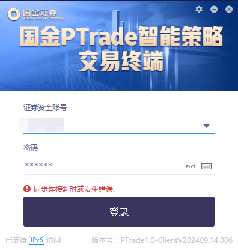

# 常见问题QA

Ptrade常见问题(不定期收集群友反馈的问题) [常见问题说明](https://ptradeapi.com/hub/data/qa_data.html)

## Ptrade常见问题(不定期收集群友反馈的问题)

### 1.为什么实盘客户端没有回测按钮？

因为原来的实盘客户端的回测功能占用的实盘交易资源，有占用实盘交易资源的风险，现已取消该功能。移到模拟客户端中，如果需要使用回测功能，需要额外申请一个模拟客户端账号

部分券商的实盘客户端虽然保留了回测功能，但也限制回测时间，盘中交易时间不可回测

### 2.L2数据是否收费？

不收费。不过目前已知的只有国金有L2逐笔数据。全部的ptrade都可以获取委托10档的数据

### 3.Ptrade关闭后程序会暂停吗？

不会。程序会每天盘前开始自动运行

### 4.ptrade内置的条件单，策略，网格等工具，关闭ptrade会停止运行？

会停止运行。这些图像界面操作的量化功能，非编程模块的，需要开启ptrade才能运行，关闭ptrade后也会停止了

### 5.ptrade可以连接外部数据，外网吗？

不可以。ptrade的运行环境是封闭的，无法连接外网。国盛证券除外

如果ptrade内置的数据无法满足，可以尝试使用tushare，目前ptrade内置了tushare的第三方包，可以通过import导入

比如使用tushare获取股票实际流通股本

```python
import tushare as ts
token = '官网获取，如果没有可以通过推荐链接注册：https://tushare.pro/register?reg=217168，默认就有积分，可以获取基础数据' 

ts.set_token(token)
pro = ts.pro_api()

def free_share():
    """
    获取实际流通股本
    """
    df = pro.daily_basic(ts_code='', trade_date='20250808', fields='ts_code,trade_date,free_share')
    return df

```

### 6.ptrade支持哪些数据库？

ptrade内置了sqlite3数据库，可以直接使用import sqlite3导入使用，可以作为自己的持久化数据库，不同策略共同访问全局数据

### 7.ptrade可以获取集合竞价的数据吗？

可以。使用get_snapshot函数，使用run_daily设定启动时间为09:15，然后在循环体里遍历，设置time.sleep, 每过3s获取一次数据。可以获取全部集合竞价数据

### 8.ptrade可以获取港股数据吗？

目前暂不支持港股数据的获取与下单

### 9.ptrade可以获取期货数据吗？

目前暂不支持期货数据的获取与下单

### 10.ptrade类的持久化的细节

不能在一个类里调用另一个类的持久化数据成员，否则会报错

```python
class A:

    def __init__(self):
        pass
    
    def run(self):
        pass
    
    g.__a = A()

    class B:
        def __init__(self):
            g.__a.run()  # 这样会报错，不能在一个类里调用另一个类的持久化数据成员


```

可以改成这样

```python
class A:

    def __init__(self):
        pass
    
    def run(self):
        pass
    
    class B:
        def __init__(self):
            a = A()
            a.run()
</p>

```

### 11.Ptrade登录不上

 1. 交易日晚上交割时间（不同券商交割时间不同，一般20~22点）, Ptrade登录不上（测试端或实盘端）；周五到周六系统维护结算，也无法登录

2. ptrade太久没有登录，导致旧版本文件无法更新。提示：同步连接超时或发生错误。解决办法：下载当前版本ptrade，下载最新版本的ptrade，重新按照最新版本即可

### 12.2个策略A和B同时运行，A策略成交时触发的回调事件会被B策略捕获吗？

不会。每个策略的回调事件是独立的，不会相互影响。
